---

name: ArXiviz Project Plan

overview: "Build ArXiviz - a tool that transforms arXiv ML/CS papers into interactive scrollytelling experiences with Manim visualizations. Four-person team with parallel pipeline: Paper Ingestion, Content Generation (AI/Manim), Rendering Backend, and Frontend."

todos:

- id: create-docs

content: Create AgentDocs/ folder with all 8 documentation files for team reference

status: completed

- id: init-structure

content: Initialize monorepo with frontend/ (Next.js) and backend/ (FastAPI) directories

status: pending

- id: team1-ingestion

content: "Team 1: Build paper ingestion pipeline (arXiv fetch, PDF parse, section extract)"

status: pending

- id: team2-agents

content: "Team 2: Build AI agent pipeline (analyzer, planner, generator, validator)"

status: pending

- id: team3-backend

content: "Team 3: Build Modal runner, storage, database, job queue, and API endpoints"

status: pending

- id: team4-frontend

content: "Team 4: Build Next.js scrollytelling frontend with video playback"

status: pending

- id: integration

content: Integrate all pipeline pieces and test end-to-end with 'Attention Is All You Need' paper

status: pending

isProject: false

---

# ArXiviz: Research Paper Visualization Platform

## Project Vision

Transform dense arXiv papers into beautiful, interactive scrollytelling experiences with Manim-generated visualizations. Users change `arxiv.org` to `arxiviz.org` in any paper URL to get an accessible, visual explanation.

---

## Architecture Overview

```mermaid
flowchart LR
    subgraph ingestion [Team 1: Paper Ingestion]
        A[ArXiv URL] --> B[Fetch PDF/HTML]
        B --> C[Parse Sections]
        C --> D[Structured JSON]
    end

    subgraph generation [Team 2: Content Generation]
        D --> E[Section Analyzer Agent]
        E --> F[Visualization Planner Agent]
        F --> G[Manim Code Generator Agent]
        G --> H[Code Validator Agent]
    end

    subgraph backend [Team 3: Rendering Backend]
        H --> I[Modal.com Manim Runner]
        I --> J[Video Storage S3/R2]
        J --> K[PostgreSQL Cache]
        K --> L[REST API]
    end

    subgraph frontend [Team 4: Frontend]
        L --> M[Next.js App]
        M --> N[Scrollytelling UI]
        N --> O[Video Player]
    end
```



---

## Tech Stack

| Layer | Technology |

| ---------------- | ---------------------------------------------------- |

| Frontend | Next.js 14 (App Router), Tailwind CSS, Framer Motion |

| Backend API | Python FastAPI |

| LLM | Anthropic Claude (claude 4.5 opus) |

| Video Generation | Manim Community Edition on Modal.com |

| Database/Cache | PostgreSQL + Redis |

| Storage | S3-compatible (Cloudflare R2 or AWS S3) |

---

## Team Division (4 Members)

### Team Member 1: Paper Ingestion Pipeline

**Goal**: Take an arXiv URL and output structured, section-by-section paper data

- **ArXiv Fetcher**: Use arXiv API to get paper metadata, PDF URL, and HTML if available
- **PDF Parser**: Use `pymupdf4llm` or `marker-pdf` to extract text with structure
- **HTML Parser**: extract text with structure by headers
- **Section Extractor**: Identify headers, equations, figures, and logical sections
- **Output**: Clean JSON with sections, each containing title, content, equations, figure refs

**Key Files to Create**:

- `backend/ingestion/arxiv_fetcher.py`
- `backend/ingestion/pdf_parser.py`
- `backend/ingestion/section_extractor.py`
- `backend/models/paper.py` (Pydantic models)

---

### Team Member 2: Content Generation (AI Pipeline)

**Goal**: Analyze sections and generate high-quality Manim visualization code

**Multi-Agent Approach** (quality over speed):

1. **Section Analyzer Agent**: Reads each section, identifies concepts that benefit from visualization (complex math, architectures, algorithms, data flows)
2. **Visualization Planner Agent**: For each "visualizable" concept, creates a detailed storyboard - what to show, in what order, what metaphors to use
3. **Manim Code Generator Agent**: Takes storyboard and generates Manim Python code. Uses few-shot examples of good Manim patterns
4. **Code Validator Agent**: Syntax checks the Manim code, ensures it follows best practices, iterates if needed

**Key Files to Create**:

- `backend/agents/section_analyzer.py`
- `backend/agents/visualization_planner.py`
- `backend/agents/manim_generator.py`
- `backend/agents/code_validator.py`
- `backend/prompts/` (all Claude prompts as markdown files)
- `backend/examples/` (few-shot Manim examples)

---

### Team Member 3: Rendering Backend & Infrastructure

**Goal**: Execute Manim code serverlessly, store videos, manage state, and expose API endpoints

**Tech Stack**: Python, FastAPI, Modal.com, PostgreSQL, Redis, S3/R2

**Responsibilities**:

- **Modal.com Runner**: Serverless function that takes Manim code, renders video, returns URL
- **Video Storage**: S3/R2 bucket upload/download utilities
- **Database Layer**: PostgreSQL for paper metadata, processing status, cached results
- **Job Queue**: Redis for async render job management
- **API Endpoints**: FastAPI routes that serve as the contract with Team 4

**Key Files to Create**:

- `backend/rendering/modal_runner.py` - Modal.com function definition
- `backend/rendering/storage.py` - S3/R2 upload/download utilities
- `backend/db/models.py` - SQLAlchemy/Pydantic models
- `backend/db/connection.py` - Database connection management
- `backend/queue/worker.py` - Redis job worker
- `backend/api/routes.py` - FastAPI endpoint definitions
- `backend/api/schemas.py` - Request/response Pydantic models

---

### Team Member 4: Frontend & User Experience

**Goal**: Build the scrollytelling frontend that displays papers with embedded videos

**Tech Stack**: TypeScript, Next.js 14 (App Router), Tailwind CSS, Framer Motion

**Responsibilities**:

- **Next.js Application**: App Router setup, routing, SSR/CSR strategy
- **Scrollytelling UX**: Sections scroll into view, videos play at appropriate moments
- **Video Integration**: Embedded video player with playback controls
- **State Management**: Loading states, progress indicators, error handling
- **Responsive Design**: Mobile-friendly layout and interactions
- **API Client**: Typed API client for backend communication (with mock support)

**Key Files to Create**:

- `frontend/app/layout.tsx` - Root layout
- `frontend/app/page.tsx` - Landing page
- `frontend/app/abs/[...id]/page.tsx` - Paper display page (mirrors arXiv URL)
- `frontend/app/abs/[...id]/loading.tsx` - Loading state
- `frontend/components/ScrollySection.tsx` - Individual scrolling section
- `frontend/components/VideoPlayer.tsx` - Video playback component
- `frontend/components/LoadingState.tsx` - Processing/loading indicators
- `frontend/components/ProgressBar.tsx` - Processing progress
- `frontend/components/PaperHeader.tsx` - Paper title, authors, abstract
- `frontend/lib/api.ts` - Typed API client
- `frontend/hooks/useScrollPosition.ts` - Scroll tracking hook
- `frontend/hooks/usePaperData.ts` - Data fetching hook
- `frontend/hooks/useProcessingStatus.ts` - Status polling hook

**Design Requirements**:

- URL structure: `/abs/{paper_id}` mirrors arXiv
- Progressive loading: Display sections as they complete
- Keyboard navigation support
- Dark/light mode toggle

---

## API Endpoints (Team 3 Owns, Team 4 Consumes)

```
POST /api/process          # Start processing a paper (accepts arXiv ID)
GET  /api/status/{job_id}  # Check processing status (polling endpoint)
GET  /api/paper/{arxiv_id} # Get processed paper with videos (final result)
GET  /api/video/{video_id} # Get video URL/stream (direct video access)
```

**API Response Schemas** (defined by Team 3, consumed by Team 4):

```python
# POST /api/process response
{"job_id": "uuid", "status": "queued", "paper_id": "1706.03762"}

# GET /api/status/{job_id} response
{"job_id": "uuid", "status": "processing|completed|failed",
 "progress": 0.6, "sections_completed": 3, "sections_total": 5}

# GET /api/paper/{arxiv_id} response
{"paper_id": "1706.03762", "title": "Attention Is All You Need",
 "sections": [{"id": "s1", "title": "...", "video_url": "/api/video/xyz"}]}
```

---

## Data Flow Example

1. User visits `arxiviz.org/abs/1706.03762`
2. **Team 4 Frontend** calls `GET /api/paper/1706.03762`
3. **Team 3 Backend** checks cache:

  - If cached → return immediately
  - If not → trigger async processing

1. Processing pipeline:

  - **Team 1** fetches and parses paper from arXiv
  - **Team 2** generates Manim code for relevant sections
  - **Team 3** queues Modal jobs, stores videos in S3

1. **Team 4 Frontend** polls status, displays sections progressively
2. Final scrollytelling experience with embedded videos

---

## Integration Points

| From | To | Interface |

|------|-----|-----------|

| Team 1 | Team 2 | Structured JSON (paper sections) |

| Team 2 | Team 3 | Manim code strings |

| Team 3 | Team 4 | REST API (JSON responses) + Video URLs (S3/R2) |

---

## Parallel Development Strategy

```
Timeline:
Day 1:     [Team 3 + Team 4] → Agree on API contract (schemas, endpoints)
           │
Days 1-3:  [Team 3] → Build real backend with Modal.com, S3, Redis
           [Team 4] → Build frontend with MOCKED API responses
           │
Day 3-4:   [Integration] → Swap mocks for real endpoints, test E2E
```

**Team 4 Mock Strategy**:

```typescript
// frontend/lib/api.ts - can toggle between mock and real
const USE_MOCK = process.env.NEXT_PUBLIC_USE_MOCK === "true";

export async function getPaper(arxivId: string) {
  if (USE_MOCK) return MOCK_PAPER_DATA;
  return fetch(`${API_BASE}/api/paper/${arxivId}`).then((r) => r.json());
}
```

---

## Prioritized MVP Features

**Must Have (Days 1-3)**:

- ArXiv paper fetching and parsing
- Section analysis and visualization planning
- Manim code generation for 2-3 visualization types (math equations, architectures, algorithms)
- Modal.com rendering pipeline
- Basic scrollytelling frontend

**Nice to Have (Day 4)**:

- Caching layer
- Progress indicators
- Multiple paper support
- Polish UI animations

---

## Documentation Structure (AgentDocs/)

```
AgentDocs/
├── PROJECT_OVERVIEW.md      # High-level vision and architecture
├── TEAM1_INGESTION.md       # Paper ingestion pipeline details
├── TEAM2_GENERATION.md      # AI agent pipeline details
├── TEAM3_BACKEND.md         # Rendering backend & infrastructure details
├── TEAM4_FRONTEND.md        # Frontend & user experience details
├── API_SPEC.md              # API endpoint specifications (Team 3↔4 contract)
├── MANIM_PATTERNS.md        # Manim code patterns and examples
└── SETUP.md                 # Local dev setup instructions
```

---

## Next Steps

1. Create the `AgentDocs/` folder with all documentation files
2. Initialize the monorepo structure:

- `frontend/` - Next.js app
- `backend/` - FastAPI + agents

1. Each team member reads their doc and starts implementation
2. Daily sync to integrate the pipeline pieces
